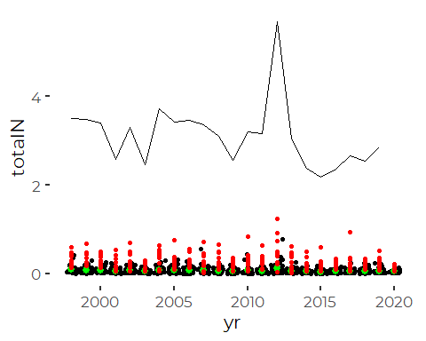
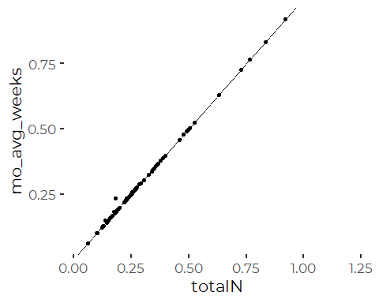
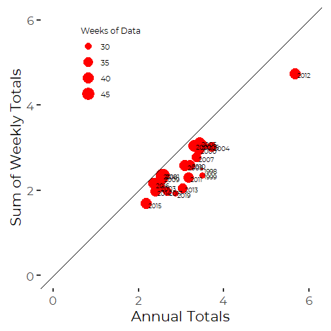
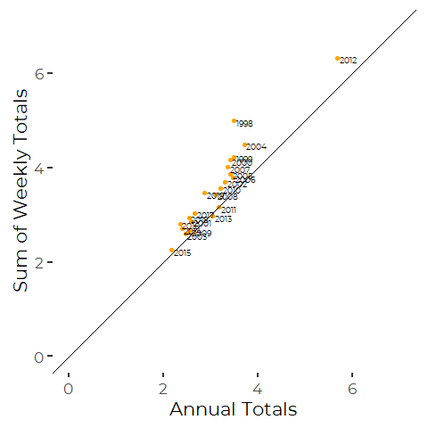
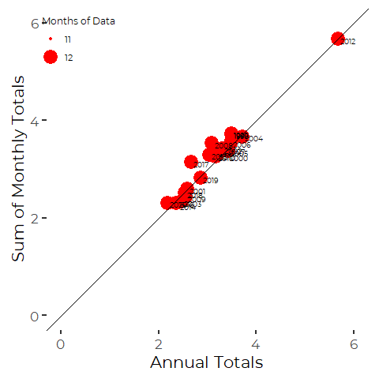
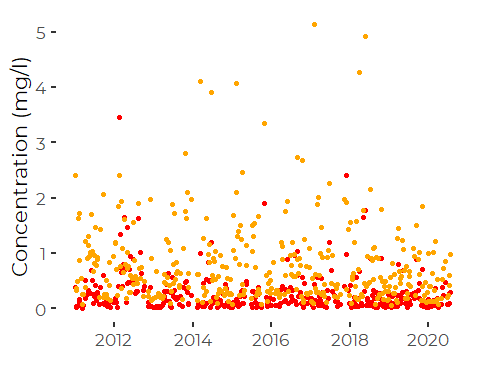

Reviewing Aggregations of Atmospheric Deposition Data
================
Curtis C. Bohlen, Casco Bay Estuary Partnership.
04/06/2021

-   [Introduction](#introduction)
-   [Install Libraries](#install-libraries)
-   [Read Weekly Data](#read-weekly-data)
-   [Read Monthly Data](#read-monthly-data)
-   [Read Annual Data](#read-annual-data)
-   [Total Weekly N Deposition](#total-weekly-n-deposition)
    -   [Converting from mg/l to mg/l N](#converting-from-mgl-to-mgl-n)
    -   [Scaling from mg/l to
        kg/m<sup>3</sup>](#scaling-from-mgl-to-kgm3)
    -   [Converting from kg/m<sup>3</sup> to
        kg/Ha](#converting-from-kgm3-to-kgha)
    -   [Should we Use `ppt` or `subppt`?](#should-we-use-ppt-or-subppt)
-   [Generate Weekly N Deposition
    Data](#generate-weekly-n-deposition-data)
-   [Monthly N Deposition](#monthly-n-deposition)
    -   [Monthly Data](#monthly-data)
-   [Analysis](#analysis)
    -   [Comparison of Weekly, Monthly, and Annual Deposition
        Estimates](#comparison-of-weekly-monthly-and-annual-deposition-estimates)
-   [Conclusion](#conclusion)
-   [Follow up: What happened in
    2012?](#follow-up-what-happened-in-2012)


# Introduction

Data on atmospheric deposition is available at several different
temporal scales, including daily, weekly, monthly, seasonal, and annual
summaries. Data is also available in both concentration and
deposition-focused versions.

In this notebook, we aggregate concentration data “by hand” to compare
to larger annual summaries.

# Install Libraries

``` r
library(readr)
library(tidyverse)
#> Warning: package 'tidyverse' was built under R version 4.0.5
#> -- Attaching packages --------------------------------------- tidyverse 1.3.1 --
#> v ggplot2 3.3.3     v dplyr   1.0.5
#> v tibble  3.1.1     v stringr 1.4.0
#> v tidyr   1.1.3     v forcats 0.5.1
#> v purrr   0.3.4
#> Warning: package 'tibble' was built under R version 4.0.5
#> Warning: package 'tidyr' was built under R version 4.0.5
#> Warning: package 'dplyr' was built under R version 4.0.5
#> Warning: package 'forcats' was built under R version 4.0.5
#> -- Conflicts ------------------------------------------ tidyverse_conflicts() --
#> x dplyr::filter() masks stats::filter()
#> x dplyr::lag()    masks stats::lag()

library(NADA)
#> Warning: package 'NADA' was built under R version 4.0.4
#> Loading required package: survival
#> 
#> Attaching package: 'NADA'
#> The following object is masked from 'package:stats':
#> 
#>     cor

library(CBEPgraphics)
load_cbep_fonts()
theme_set(theme_cbep())
```

# Read Weekly Data

``` r
sibfldnm <- 'Original_Data'
parent <- dirname(getwd())
sibling <- paste(parent,sibfldnm, sep = '/')
```

``` r
fn <- 'NTN-ME96-w.csv'
weekly_data <- read_csv(file.path(sibling, fn)) %>%
  mutate_at(vars(starts_with('flag')), ~replace_na(.,'')) %>%
  mutate_at (c('ph', 'Conduc','Ca','Mg','K', 'Na',
               'NH4', 'NO3', 'Cl', 'SO4', 'Br'), ~na_if(., -9)) %>%
  mutate(ppt = na_if(ppt, -9.99)) %>%
  # metadata says -7 is for "trace" precipitation.  Lowest non-zero value in the
  # data is 0.254, or 0.1 inch, converted to mm.
  # We replace "trace" with 0.051, or a factor of five below that.
  mutate(ppt = ifelse(ppt == -7, 0.051, ppt)) %>%
  
  mutate(yr = yrmonth %/% 100) %>%
  mutate(month = yrmonth %% 100,
         monthf = factor(month, levels = 1:12, labels = month.abb))
#> 
#> -- Column specification --------------------------------------------------------
#> cols(
#>   .default = col_double(),
#>   siteID = col_character(),
#>   labno = col_character(),
#>   dateon = col_datetime(format = ""),
#>   dateoff = col_datetime(format = ""),
#>   flagCa = col_character(),
#>   flagMg = col_character(),
#>   flagK = col_character(),
#>   flagNa = col_logical(),
#>   flagNH4 = col_character(),
#>   flagNO3 = col_character(),
#>   flagCl = col_logical(),
#>   flagSO4 = col_character(),
#>   valcode = col_character(),
#>   invalcode = col_character(),
#>   modifiedOn = col_character()
#> )
#> i Use `spec()` for the full column specifications.
```

# Read Monthly Data

``` r
fn <- 'NTN-ME96-m.csv'

monthly_data <- read_csv(file.path(sibling, fn)) %>%
  mutate_at (c('pH', 'conduc','Ca','Mg','K', 'Na',
               'NH4', 'NO3', 'Cl', 'SO4', 'Br'), ~na_if(., -9)) %>%
  # May not really be necessary, since we have start and end dates for each sample.
  mutate(plotdate = as.POSIXct(paste(yr,month, '15', sep = '-'), 
                               format='%Y-%m-%d')) %>%
  select(-c('Ca','Mg','K', 'Na', 'Cl','Br'))
#> 
#> -- Column specification --------------------------------------------------------
#> cols(
#>   .default = col_double(),
#>   siteID = col_character(),
#>   startDate = col_datetime(format = ""),
#>   lastDate = col_datetime(format = "")
#> )
#> i Use `spec()` for the full column specifications.
```

# Read Annual Data

``` r
fn <- 'NTN-ME96-cydep.csv'
annual_data <- read_csv(file.path(sibling, fn)) %>%
  mutate_at (c('Ca','Mg','K', 'Na','totalN', 'Cl', 'SO4', 'Br'), ~na_if(., -9)) %>%
  select(-c('Ca','Mg','K', 'Na', 'Cl','SO4', 'Br'))
#> 
#> -- Column specification --------------------------------------------------------
#> cols(
#>   .default = col_double(),
#>   siteID = col_character(),
#>   seas = col_character(),
#>   startDate = col_datetime(format = ""),
#>   lastDate = col_datetime(format = "")
#> )
#> i Use `spec()` for the full column specifications.
```

# Total Weekly N Deposition

Weekly data is in the form of concentrations – in mg/l. Total deposition
is, therefore, related to precipitation. We want weekly loads in terms
of mass per unit area per month. The annual deposition data is provided
in kg/Ha, so we want our weekly data to conform to that. We need to
convert units as follows:

### Converting from mg/l to mg/l N

First we have to convert from measuring nitrate (NO3) and ammonium (NH4)
in concentrations of mg/l to units of mg/l N. For that, we convert to
moles and back to moles of N. In general:

$$\[NH\_{4}\] \~ \\text{(mg/l)} \\times 
            \\frac{1}{\\text{M.W. of NH}\_4 \\text{(g/mol)}} \\times 
            \\text{M.W. of N (g/mol)} \\approx 
            \\text{NH}\_4 \\text{-N} (mg/l)$$

### Scaling from mg/l to kg/m<sup>3</sup>

$$ 1\~ mg/l \\times
   \\frac{1g}{1000 \~ mg} \\times 
    \\frac{1kg}{1000g}  \\times
    \\frac{1l}{1000 cm^3} \\times
    (\\frac{100 cm}{1m})^3 =
    kg/m^3  $$

The net effect is to multiply by 0.001:
10<sup> − 3</sup> × 10<sup> − 3</sup> × 10<sup> − 3</sup> × 10<sup>6</sup> = 10<sup> − 3</sup> = 0.001

### Converting from kg/m<sup>3</sup> to kg/Ha

Annual and seasonal totals reported from the station are in kg/ha (as
NO3, NH4, or N, depending on the nitrogen parameter).

Conversion is based on precipitation, which is recorded in cm in monthly
(seasonal) and annual data, and in mm for the weekly (and daily) data.
The net effect is that the conversion factor for precipitation (P) in
cm, time 100:

$$
kg/m^3 \\times 
(P(cm) \\times \\frac{1m}{100cm}) \\times 
10,000 m^2/Ha) = 
P \\times 100
$$
And for data in mm, we use a factor of 10.

## Should we Use `ppt` or `subppt`?

It looks like the two are equal in this data set. Metadata suggests
`subppt` replaces some missing values, so it may be slightly more
complete. Note that `subppt` is only available from the weekly data,
which won’t show up here.

# Generate Weekly N Deposition Data

``` r
MW_NH4 <- 14.007 + (1.008 * 4)
MW_NO3 <- 14.007 +(15.999 * 3)
MW_N <- 14.007

weekly_dep_data <- weekly_data %>%
  select(yr, month, ppt, dateon, dateoff, svol, subppt, 
         valcode, invalcode, NH4, flagNH4, NO3, flagNO3) %>%
  
  # Convert to total N, in kg/m^3
  mutate(NH4_N = NH4*(MW_N / MW_NH4) * 10^-3,
         NO3_N = NO3*(MW_N / MW_NO3)* 10^-3,
         concN = NH4_N + NO3_N) %>%
  
  # Convert to kg/ha
  mutate(NH4_N_tot = NH4_N * ppt * 10,
         NO3_N_tot =   NO3_N * ppt * 10,
          totalN  = NH4_N_tot + NO3_N_tot,
         logtotalN = log(totalN),
         log1ptotalN = log1p(totalN)) %>%
  
  # Calculate a "censored value flag" for total N
  # The following indicates when EITHER constituent was censored.  What we know
  # is the sum is LESS THAN the sum of the censored and uncensored values, so 
  # this works
  mutate(flagconcN = if_else(((flagNH4 == '<' ) | (flagNO3 == '<')), '<',''),
         flagtotalN = flagconcN)
```

# Monthly N Deposition

The monthly data comes in the form of “precipitation weighted mean
concentrations.” We find nothing in the metadata that clearly describes
methods, so we’re not 100% certain what this means. Our interpretation
is that this is a weighted average, where each weekly observation is
weighted by the weekly precipitation to generate a monthly estimate.
This should allow us to get a good estimate of total deposition by
multiplying by the total precipitation of the month. Again, we am
uncertain how missing values and low-quality data were handled.

We want monthly loads in terms of mass per unit area per month. The
annual deposition data is provided in kg/Ha, so we can follow the same
strategy we used for the weekly samples. (Note that the sum of weekly
values may not identically match the monthly estimates, since not all
weekly values are valid.)

## Monthly Data

``` r
monthly_dep_data <- monthly_data %>%
  select(-SO4) %>%
  mutate(NH4_N = NH4*(MW_N / MW_NH4) * 10^-3, 
         NO3_N = NO3*(MW_N / MW_NO3)* 10^-3,
         concN = NH4_N+NO3_N, 
         totalN  = (NO3_N + NH4_N)*ppt * 100,
         logtotalN = log(totalN),
         log1ptotalN = log1p(totalN))
```

# Analysis

## Comparison of Weekly, Monthly, and Annual Deposition Estimates

``` r
ggplot(weekly_dep_data,aes(yr, totalN)) +
  geom_jitter() +
  stat_summary(color = 'green') +
  geom_point(data = monthly_dep_data, mapping = aes(yr, totalN), color = 'red') +
  geom_line(data = annual_data, mapping = aes(yr, totalN))
#> Warning: Removed 328 rows containing non-finite values (stat_summary).
#> No summary function supplied, defaulting to `mean_se()`
#> Warning: Removed 328 rows containing missing values (geom_point).
#> Warning: Removed 2 rows containing missing values (geom_point).
```



Weekly values are in black. Annual means of the weekly data are green.
Monthly reported values are red dots.

Weekly data should be about a quarter of monthly data. Monthly data
should be about 1/12 of annual values. It looks like we are pretty
close.

``` r
tmp1 <- weekly_dep_data %>%
  group_by(month,yr) %>%
 summarize (mo_avg_weeks = sum(totalN),
            .groups = 'drop')

tmp2 <- monthly_dep_data %>%
  left_join(tmp1)
#> Joining, by = c("month", "yr")
```

``` r
ggplot(tmp2, aes(totalN, mo_avg_weeks)) +
  geom_point() +
  geom_abline(slope = 1, intercept = 0)
#> Warning: Removed 195 rows containing missing values (geom_point).
```



Monthly and weekly data are NEARLY identical when pooled to monthly
totals.

``` r
tmp1 <- weekly_dep_data %>%
  group_by(yr) %>%
  summarize (ann_dep_weeks = sum(totalN, na.rm = TRUE),
             n_weeks = sum(! is.na(totalN)),
            .groups = 'drop')

tmp2 <- monthly_dep_data %>%
  group_by(yr) %>%
  summarize (ann_dep_months =  sum(totalN, na.rm = TRUE),
             n_months = sum(! is.na(totalN)),
            .groups = 'drop')

tmp3 <- annual_data %>%
  rename(annual_dep = totalN) %>%
  left_join(tmp1, by = "yr") %>%
  left_join(tmp2, by = "yr")
```

``` r
ggplot(tmp3, aes(annual_dep)) +
  geom_point(aes(y = ann_dep_weeks, size = n_weeks), color = 'red') +
  geom_text(aes(label = yr, y = ann_dep_weeks), 
            size = 2.5,
            nudge_x = 0.05, nudge_y = -0.025, hjust = 0) +
  scale_size(name = 'Weeks of Data') +
  theme(legend.text = element_text(size = 8),
        legend.title = element_text(size = 9),
        legend.position = c(.25, .8)) +
  geom_abline(slope = 1, intercept = 0) +
  xlab('Annual Totals') +
  ylab('Sum of Weekly Totals') +
  xlim(0,6) +
  ylim(0,6) +
  coord_equal()
```


So here what we are seeing is sums of weekly values that are LOW –
presumably because of missing values. Dots are scaled by number of
weekly samples available, and there is an apparent relationship. Sums of
weekly totals are slightly higher for years with more weeks of usable
data.

We can check if that is the only difference by calculating a version
scaled by weeks with usable data:

``` r
tmp3 %>%
  mutate(est_dep_weeks =  ann_dep_weeks *(52/n_weeks)) %>%
ggplot(aes(annual_dep)) +
  geom_point(aes(y = est_dep_weeks), color = 'orange') +
  geom_text(aes(label = yr, y = est_dep_weeks), 
            size = 2.5,
            nudge_x = 0.05, nudge_y = -0.025, hjust = 0) +
  scale_size(name = 'Weeks of Data') +
  theme(legend.text = element_text(size = 8),
        legend.title = element_text(size = 9),
        legend.position = c(.25, .8)) +
  geom_abline(slope = 1, intercept = 0) +
  xlab('Annual Totals') +
  ylab('Sum of Weekly Totals') +
  xlim(0,7) +
  ylim(0,7) +
  coord_equal()
```


That gets us close to that 1:1 line, but it over corrects compared to
what the data providers did. It is possible that the annual sums
provided are based on adding up data that can be ruled valid (or not) on
a shorter time interval.

``` r
ggplot(tmp3, aes(annual_dep, )) +
  geom_point(aes(y = ann_dep_months, size = n_months), color = 'red') +
  geom_text(aes(label = yr, y = ann_dep_months), 
            size = 2.5,
            nudge_x = 0.05, nudge_y = -0.025, hjust = 0) +
  scale_size(breaks = c(11,12), name = 'Months of Data') +
  theme(legend.text = element_text(size = 8),
        legend.title = element_text(size = 9),
        legend.position = c(.1, .9)) +
  geom_abline(slope = 1, intercept = 0) +
  xlab('Annual Totals') +
  ylab('Sum of Monthly Totals') +
  xlim(0,6) +
  ylim(0,6) +
  coord_equal()
```


Monthly totals are not equal to the annual values. There is a high
correlation, but they are not identical. Presumably this reflects data
the process of weighting actual data, QA/QC, and related processes.

# Conclusion

We have confirmed that the weekly and monthly data represent what we
thought they did, but also that we do not fully understand the process
by which the data are aggregated to annual (and monthly, seasonal)
totals.

We could continue to explore this further by looking at the values of
`Criteria1`, `Criteria2`, and `Criteria3`, and try to reconstruct the
way aggregated values are assembled.

| Name      | Value | Meaning                                                                                                                             |
|-----------|-------|-------------------------------------------------------------------------------------------------------------------------------------|
| Criteria1 | 75    | Percentage of the summary period for which there are valid samples.                                                                 |
| Criteria2 | 90    | Percentage of the summary period for which precipitation amounts are available either from the rain gage or from the sample volume. |
| Criteria3 | 75    | Percentage of the total measured precipitation associated with valid samples.                                                       |

For State of Casco Bay purposes, we are going to be better off relying
on the aggregation prepared by the data providers. The only exception is
going to be if we want to conduct detailed time series analyses, which
are not necessary for SoCB.

The only weakness of this approach is that we are unable to carry
forward estimates of precision or error for the aggregates we report.
However, for the annual data,

# Follow up: What happened in 2012?

Data for 2012 shows estimated annual deposition higher by nearly a
factor of two than other data. It’s worth doing a little digging to see
what happened.

The first thing to notice is that while the estimated annual totals
reported for 2012 are somewhat higher than the weekly totals, they are
not “out of line” with the other annual estimates. The annual totals are
proportionally about the same degree higher than other years…

``` r
annual_data %>%
  filter(yr == 2012) %>%
  select(yr, contains('Criteria'))
#> # A tibble: 1 x 4
#>      yr Criteria1 Criteria2 Criteria3
#>   <dbl>     <dbl>     <dbl>     <dbl>
#> 1  2012        81       100        83
```

SO note that 2012 meets all three of the data quality criteria. it is
NOT a year we can ignore as invalid data.

``` r
weekly_data %>%
  filter(yr > 2010) %>%
  ggplot(aes(dateon)) +
  geom_point(aes(y = NH4), color = 'red') +
  geom_point(aes(y = NO3), color = 'orange') +
  ylab('Concentration (mg/l)') +
  xlab('')
#> Warning: Removed 120 rows containing missing values (geom_point).

#> Warning: Removed 120 rows containing missing values (geom_point).
```


We note no anomalously high nitrate values in 2012, but several high –
but not outrageous – NH4 concentrations that year.

That year saw significant changes in management at Wolfe’s Neck Farm. It
is possible that 2012 was the year that the Wolfe’s Neck Farm manure
management system was decommissioned, which would have released
significant ammonium locally. If that is the case, that year would not
be reflective of regional deposition.

We have placed a call to Wolfe Neck Farm to explore and hopefully
confirm that possibility.
