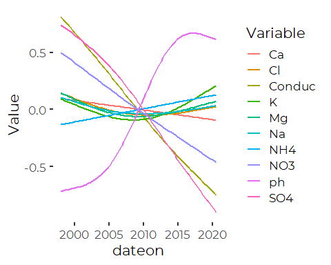

Preliminary Analysis of Atmospheric Deposition Data
================
Curtis C. Bohlen, Casco Bay Estuary Partnership.
04/06/2021

-   [Install Libraries](#install-libraries)
-   [Read Weekly Data](#read-weekly-data)
    -   [Create the “Long” Version of the
        data](#create-the-long-version-of-the-data)
-   [Exploring the “flag”data](#exploring-the-flagdata)
    -   [Detection limits](#detection-limits)
-   [Plot Data For Exploratory Data
    Analysis](#plot-data-for-exploratory-data-analysis)
-   [Pairs Plots and Correlations](#pairs-plots-and-correlations)
    -   [Log Transformed Pairs Plot](#log-transformed-pairs-plot)
    -   [Correlations](#correlations)
-   [How many Observations?](#how-many-observations)
-   [How Many at Detection Limits?](#how-many-at-detection-limits)
-   [Focus on Ammonium and Nitrate](#focus-on-ammonium-and-nitrate)
    -   [Concentrations and Rainfall](#concentrations-and-rainfall)
        -   [Ammonium](#ammonium)
        -   [Nitrate](#nitrate)
    -   [Deposition and Rainfall](#deposition-and-rainfall)
        -   [Generate N Deposition Data](#generate-n-deposition-data)
        -   [Ammonium](#ammonium-1)
        -   [Nitrate](#nitrate-1)
        -   [Total Nitrogen](#total-nitrogen)


# Install Libraries

``` r
library(readr)
library(tidyverse)
#> Warning: package 'tidyverse' was built under R version 4.0.5
#> -- Attaching packages --------------------------------------- tidyverse 1.3.1 --
#> v ggplot2 3.3.3     v dplyr   1.0.5
#> v tibble  3.1.1     v stringr 1.4.0
#> v tidyr   1.1.3     v forcats 0.5.1
#> v purrr   0.3.4
#> Warning: package 'tibble' was built under R version 4.0.5
#> Warning: package 'tidyr' was built under R version 4.0.5
#> Warning: package 'dplyr' was built under R version 4.0.5
#> Warning: package 'forcats' was built under R version 4.0.5
#> -- Conflicts ------------------------------------------ tidyverse_conflicts() --
#> x dplyr::filter() masks stats::filter()
#> x dplyr::lag()    masks stats::lag()
library(GGally)
#> Warning: package 'GGally' was built under R version 4.0.5
#> Registered S3 method overwritten by 'GGally':
#>   method from   
#>   +.gg   ggplot2

library(CBEPgraphics)
load_cbep_fonts()
theme_set(theme_cbep())
```

# Read Weekly Data

``` r
sibfldnm <- 'Original_Data'
parent <- dirname(getwd())
sibling <- paste(parent,sibfldnm, sep = '/')
fn <- 'NTN-ME96-w.csv'
```

``` r
weekly_data <- read_csv(paste(sibling, fn, sep='/')) %>%
  mutate_at(vars(starts_with('flag')), ~replace_na(.,'')) %>%
  mutate_at (c('ph', 'Conduc','Ca','Mg','K', 'Na','NH4', 
               'NO3', 'Cl', 'SO4', 'Br'), 
             ~na_if(., -9)) %>%
  mutate(ppt = ifelse(ppt==-7, NA, ppt)) %>%
  mutate(yr = yrmonth %/% 100) %>%
  mutate(month = yrmonth %% 100)
#> 
#> -- Column specification --------------------------------------------------------
#> cols(
#>   .default = col_double(),
#>   siteID = col_character(),
#>   labno = col_character(),
#>   dateon = col_datetime(format = ""),
#>   dateoff = col_datetime(format = ""),
#>   flagCa = col_character(),
#>   flagMg = col_character(),
#>   flagK = col_character(),
#>   flagNa = col_logical(),
#>   flagNH4 = col_character(),
#>   flagNO3 = col_character(),
#>   flagCl = col_logical(),
#>   flagSO4 = col_character(),
#>   valcode = col_character(),
#>   invalcode = col_character(),
#>   modifiedOn = col_character()
#> )
#> i Use `spec()` for the full column specifications.
```

## Create the “Long” Version of the data

``` r
long_data <- weekly_data %>%
  select(-starts_with('flag')) %>%
  gather(ph, Conduc, Ca,Mg,K,Na,NH4,NO3,Cl, SO4, Br, key = 'Variable', value = 'Value')
```

# Exploring the “flag”data

Flags indicate limit of detection. Here we confirm how they are used and
whether there are numbers paired up with them.

``` r
sum(weekly_data$flagCa=='NA', na.rm=TRUE)
#> [1] 0
sum(weekly_data$flagCa!='NA', na.rm=TRUE)
#> [1] 1177
levels(factor(weekly_data$flagCa))
#> [1] ""  "<"
```

``` r
plt <- ggplot(weekly_data, aes(x=flagNH4, y=NH4)) + geom_violin(scale = 'count')
plt
#> Warning: Removed 277 rows containing non-finite values (stat_ydensity).
```


The -9 values reflect true missing data, while the flagged values are
left censored, at the given value.

## Detection limits

Are these singly censored or multiply censored?

``` r
long_data.flags <- weekly_data %>%
  select(starts_with('flag')) %>%
  gather('flagCa','flagMg','flagK','flagNa','flagNH4','flagNO3','flagCl', 
         'flagSO4', 'flagBr', key = 'Variable', value = 'Flag')

tmp <- long_data %>%
  filter(Variable %in% c('Ca','Mg','K','Na','NH4','NO3','Cl', 'SO4', 'Br')) %>%
  mutate(Flag = long_data.flags$Flag) %>%
  select(dateon,Variable, Value, Flag) %>%
  filter(Flag=='<') %>%
  select(-Flag) %>%
  spread(Variable, Value)

for (cc in c('Ca','Mg','K','Na','NH4','NO3','Cl', 'SO4', 'Br'))
{print(cc)
  print(levels(factor(tmp[[cc]])))}
#> [1] "Ca"
#> [1] "0.01"  "0.019" "0.023" "0.027"
#> [1] "Mg"
#> [1] "0.003" "0.005" "0.006" "0.009"
#> [1] "K"
#> [1] "0.001" "0.003" "0.005"
#> [1] "Na"
#> character(0)
#> [1] "NH4"
#> [1] "0.004" "0.005" "0.006" "0.01"  "0.016" "0.017" "0.018" "0.02"  "0.19" 
#> [1] "NO3"
#> character(0)
#> [1] "Cl"
#> character(0)
#> [1] "SO4"
#> character(0)
#> [1] "Br"
#> character(0)

rm(long_data.flags)
```

So, we have multiple different values flagged as detection limits for
most of the parameters, For ammonium, the detection limits vary by a
couple of orders of magnitude. We can find no clear documentation of the
‘&lt;’ flag or its meaning in the metadata.

# Plot Data For Exploratory Data Analysis

To plot these all on one scale, we convert all observations to Z-scores
of the log of the raw data, since just about everything (except pH)
looks more or less like a lognormal distribution. We use `geom_smooth()`
but with a limited number of knots, to prevent this from getting wildly
out of hand.

Note that this preliminary graphic ignores censoring, and thus
effectively replaces all censored values with their detection limits.
This is probably O.K for exploratory purposes, but we should not take
this graphic too seriously.

``` r
plt <- long_data %>%
  group_by(Variable) %>%
  mutate(Value = scale(log(Value))) %>%
  ggplot(aes(dateon, Value, color = Variable)) +
  #geom_point() + 
  geom_smooth(method = "gam", formula = y~s(x, k = 5), se=FALSE)
plt
#> Warning: Removed 3965 rows containing non-finite values (stat_smooth).
```


Br, NO3, SO4 and Conductivity show likely declines. pH shows a likely
increase (although affected by the log transform).

# Pairs Plots and Correlations

## Log Transformed Pairs Plot

(All except pH, which we transform and then back-transform, to keep the
code simple.)

``` r
tmp<- weekly_data %>%
  select (-starts_with('flag')) %>%
  select(6:15, 19) %>%
  mutate_all(log10) %>%
  mutate(ph = exp(ph))
#> Warning in mask$eval_all_mutate(quo): NaNs produced

ggp<-ggpairs(tmp, progress = FALSE)
suppressWarnings(print(ggp))
```


The log data looks better behaved, so a lognormal distribution looks
reasonable for most indicators. It looks like censoring is not a big
deal except for the bromine values. Negative correlations with
precipitation are evident for many parameters, including the two
nitrogen-containing ions.

## Correlations

These are (implicitly here) correlations based on log transformed data
(other than pH). From the scatter plots, linear relationships are
probably O.K. for most relationships, the exception again being pH.

``` r
cor(tmp, use='pairwise', method = 'spearman')
#>                 ph     Conduc         Ca          Mg          K          Na
#> ph      1.00000000 -0.8182559 -0.3907050 -0.14705697 -0.1334678 -0.08560418
#> Conduc -0.81825589  1.0000000  0.6599164  0.52410672  0.4979577  0.40971034
#> Ca     -0.39070501  0.6599164  1.0000000  0.57668460  0.6421307  0.34207393
#> Mg     -0.14705697  0.5241067  0.5766846  1.00000000  0.8201992  0.92171194
#> K      -0.13346777  0.4979577  0.6421307  0.82019923  1.0000000  0.69211143
#> Na     -0.08560418  0.4097103  0.3420739  0.92171194  0.6921114  1.00000000
#> NH4    -0.31709660  0.5162680  0.5977806  0.19312070  0.3704631  0.01128487
#> NO3    -0.74538418  0.8202103  0.6569595  0.22909494  0.3085896  0.08205878
#> Cl     -0.10165610  0.4327474  0.3648054  0.92822882  0.7001537  0.99263537
#> SO4    -0.74518543  0.8989428  0.6664864  0.42569960  0.4691804  0.26837503
#> subppt  0.31842664 -0.3850922 -0.4760574 -0.07235764 -0.1693814  0.06241940
#>                NH4         NO3          Cl        SO4      subppt
#> ph     -0.31709660 -0.74538418 -0.10165610 -0.7451854  0.31842664
#> Conduc  0.51626800  0.82021032  0.43274737  0.8989428 -0.38509221
#> Ca      0.59778064  0.65695950  0.36480540  0.6664864 -0.47605744
#> Mg      0.19312070  0.22909494  0.92822882  0.4256996 -0.07235764
#> K       0.37046315  0.30858960  0.70015367  0.4691804 -0.16938135
#> Na      0.01128487  0.08205878  0.99263537  0.2683750  0.06241940
#> NH4     1.00000000  0.71237182  0.02797898  0.6451671 -0.39860858
#> NO3     0.71237182  1.00000000  0.10318926  0.7697691 -0.56849769
#> Cl      0.02797898  0.10318926  1.00000000  0.2862616  0.03598157
#> SO4     0.64516710  0.76976908  0.28626162  1.0000000 -0.32054134
#> subppt -0.39860858 -0.56849769  0.03598157 -0.3205413  1.00000000
cor(tmp, use='pairwise', method = 'kendall')
#>                 ph     Conduc         Ca          Mg           K           Na
#> ph      1.00000000 -0.6653836 -0.2784117 -0.10109778 -0.09263655 -0.057496379
#> Conduc -0.66538362  1.0000000  0.4816490  0.37296783  0.36214641  0.287548783
#> Ca     -0.27841167  0.4816490  1.0000000  0.41153922  0.47206709  0.241577381
#> Mg     -0.10109778  0.3729678  0.4115392  1.00000000  0.66868790  0.792793531
#> K      -0.09263655  0.3621464  0.4720671  0.66868790  1.00000000  0.540610828
#> Na     -0.05749638  0.2875488  0.2415774  0.79279353  0.54061083  1.000000000
#> NH4    -0.24794239  0.3650120  0.4394414  0.13720255  0.26131311  0.007299919
#> NO3    -0.59377280  0.6328504  0.4768653  0.16177856  0.21596143  0.056414360
#> Cl     -0.06884705  0.3017589  0.2555488  0.80111362  0.54543844  0.944323656
#> SO4    -0.57913419  0.7416043  0.4841905  0.29420882  0.33291328  0.184126418
#> subppt  0.21810130 -0.2623218 -0.3304666 -0.04882984 -0.11732731  0.041609688
#>                 NH4         NO3          Cl        SO4      subppt
#> ph     -0.247942388 -0.59377280 -0.06884705 -0.5791342  0.21810130
#> Conduc  0.365012005  0.63285042  0.30175892  0.7416043 -0.26232181
#> Ca      0.439441376  0.47686527  0.25554881  0.4841905 -0.33046659
#> Mg      0.137202553  0.16177856  0.80111362  0.2942088 -0.04882984
#> K       0.261313114  0.21596143  0.54543844  0.3329133 -0.11732731
#> Na      0.007299919  0.05641436  0.94432366  0.1841264  0.04160969
#> NH4     1.000000000  0.53647791  0.01820753  0.4614963 -0.27536670
#> NO3     0.536477912  1.00000000  0.07211124  0.5812101 -0.39824950
#> Cl      0.018207532  0.07211124  1.00000000  0.1946880  0.02395371
#> SO4     0.461496328  0.58121013  0.19468804  1.0000000 -0.21755217
#> subppt -0.275366697 -0.39824950  0.02395371 -0.2175522  1.00000000
```

These include some pretty high correlations for environmental data (but
these correlations do not properly handle non-detects).

# How many Observations?

``` r
weekly_data %>%
  select (-starts_with('flag')) %>%
  select(6:16) %>%
  summarise_all(~sum(! is.na(.)))
#> # A tibble: 1 x 11
#>      ph Conduc    Ca    Mg     K    Na   NH4   NO3    Cl   SO4    Br
#>   <int>  <int> <int> <int> <int> <int> <int> <int> <int> <int> <int>
#> 1   896    894   898   898   898   898   900   900   900   900     0
```

# How Many at Detection Limits?

``` r
weekly_data %>%
  select (starts_with('flag')) %>%
  summarise_all(~sum(.=='<', na.rm=TRUE))
#> # A tibble: 1 x 9
#>   flagCa flagMg flagK flagNa flagNH4 flagNO3 flagCl flagSO4 flagBr
#>    <int>  <int> <int>  <int>   <int>   <int>  <int>   <int>  <int>
#> 1     30     23    24      0      59       1      0       1      0
```

The ammonium data has the highest number at detection limits! However
even that’s at about one observation in 16, or about 6% censored. That’s
a low level of censoring where almost any method of handling censoring
will work O.K for most (descriptive) purposes.

# Focus on Ammonium and Nitrate

## Concentrations and Rainfall

### Ammonium

``` r
a <- round(cor(weekly_data$NH4, weekly_data$subppt, 
               use = 'pairwise', method = 'kendall'),2)
ggplot(weekly_data, aes(subppt, NH4)) +
  geom_point(color = 'blue3', alpha = .5) +
  geom_density_2d(color = 'red') +
  annotate('text', x = 0.5, y = 0.025, label = paste0('Tau =', a)) +
  geom_smooth(method = 'lm', se = FALSE) +
  scale_x_log10() +
  scale_y_log10() +
  ylab('Ammonium (mg/l)') +
  xlab('Precipitation (mm)') +
  theme_cbep(base_size = 12)
#> Warning in self$trans$transform(x): NaNs produced
#> Warning: Transformation introduced infinite values in continuous x-axis
#> Warning in self$trans$transform(x): NaNs produced
#> Warning: Transformation introduced infinite values in continuous x-axis
#> Warning in self$trans$transform(x): NaNs produced
#> Warning: Transformation introduced infinite values in continuous x-axis
#> Warning: Removed 277 rows containing non-finite values (stat_density2d).
#> `geom_smooth()` using formula 'y ~ x'
#> Warning: Removed 277 rows containing non-finite values (stat_smooth).
#> Warning: Removed 277 rows containing missing values (geom_point).
```


### Nitrate

``` r
a <- round(cor(weekly_data$NO3, weekly_data$subppt,
               use = 'pairwise', method = 'kendall'),2)
ggplot(weekly_data, aes(subppt, NO3)) +
  geom_point(color = 'blue3', alpha = .5) +
  geom_density_2d(color = 'red') +
  annotate('text', x = 0.5, y = 0.3, label = paste0('Tau =', a)) +
  geom_smooth(method = 'lm', se = FALSE) +
  scale_x_log10() +
  scale_y_log10() +
  ylab('Nitrate (mg/l)') +
  xlab('Precipitation (mm)') +
  theme_cbep(base_size = 12)
#> Warning in self$trans$transform(x): NaNs produced
#> Warning: Transformation introduced infinite values in continuous x-axis
#> Warning in self$trans$transform(x): NaNs produced
#> Warning: Transformation introduced infinite values in continuous x-axis
#> Warning in self$trans$transform(x): NaNs produced
#> Warning: Transformation introduced infinite values in continuous x-axis
#> Warning: Removed 277 rows containing non-finite values (stat_density2d).
#> `geom_smooth()` using formula 'y ~ x'
#> Warning: Removed 277 rows containing non-finite values (stat_smooth).
#> Warning: Removed 277 rows containing missing values (geom_point).
```


What we see is that both ammonium and nitrate CONCENTRATIONS decline
with more rainfall. Since a roughly factor of 100 increase in rainfall
is associated with roughly a factor of 10 decrease in concentrations,
total N delivery clearly goes up substantially with rainfall.

We redraw, and change the x axis transformation to capture data with no
associated rainfall.

## Deposition and Rainfall

### Generate N Deposition Data

``` r
MW_NH4 <- 14.007 + (1.008 * 4)
MW_NO3 <- 14.007 +(15.999 * 3)
MW_N <- 14.007

weekly_dep_data <- weekly_data %>%
  select(yr, month, ppt, dateon, dateoff, subppt, 
         NH4, flagNH4, NO3, flagNO3) %>%
  
  # Convert to total N, in kg/m^3
  mutate(NH4_N = NH4*(MW_N / MW_NH4) * 10^-3,
         NO3_N = NO3*(MW_N / MW_NO3)* 10^-3,
         concN = NH4_N + NO3_N) %>%
  
  # Convert to kg/ha
  mutate(NH4_N_tot = NH4_N * ppt * 10,
         NO3_N_tot =   NO3_N * ppt * 10,
          totalN  = NH4_N_tot + NO3_N_tot,
         logtotalN = log(totalN),
         log1ptotalN = log1p(totalN)) %>%
  
  # Calculate a "censored value flag" for total N
  # The following indicates when EITHER constituent was censored.  What we know
  # is the sum is LESS THAN the sum of the censored and uncensored values, so 
  # this works
  mutate(flagconcN = if_else(((flagNH4 == '<' ) | (flagNO3 == '<')), '<',''),
         flagtotalN = flagconcN)
#> Warning in log(totalN): NaNs produced
```

### Ammonium

``` r
a <- round(cor(weekly_dep_data$NH4_N_tot, weekly_data$subppt,
               use = 'pairwise', method = 'kendall'),2)

ggplot(weekly_dep_data, aes(subppt, NH4_N_tot)) +
  geom_point(aes(color = flagNH4), alpha = .5) +
  scale_color_manual(values = cbep_colors(), name = '',
                     labels = c('Observed', 'Not Detected')) +
  geom_density_2d(color = 'red') +
  annotate('text', x = 1, y = 0.25, label = paste0('Tau =', a)) +
  geom_smooth(method = 'lm', se = FALSE, color = cbep_colors()[3]) +
  scale_x_continuous(trans = 'log1p', breaks = c(0,1,5,10, 20, 50, 100, 200)) +
  scale_y_log10() +
  ylab('Ammonium Loading (kg/ha as N)') +
  xlab('Precipitation (mm)')  +
  theme_cbep(base_size = 12) +
  theme(legend.position = c(0.8, 0.25))
#> Warning in self$trans$transform(x): NaNs produced
#> Warning: Transformation introduced infinite values in continuous x-axis
#> Warning in self$trans$transform(x): NaNs produced
#> Warning: Transformation introduced infinite values in continuous y-axis
#> Warning in self$trans$transform(x): NaNs produced
#> Warning: Transformation introduced infinite values in continuous x-axis
#> Warning in self$trans$transform(x): NaNs produced
#> Warning: Transformation introduced infinite values in continuous y-axis
#> Warning in self$trans$transform(x): NaNs produced
#> Warning: Transformation introduced infinite values in continuous x-axis
#> Warning in self$trans$transform(x): NaNs produced
#> Warning: Transformation introduced infinite values in continuous y-axis
#> Warning: Removed 329 rows containing non-finite values (stat_density2d).
#> `geom_smooth()` using formula 'y ~ x'
#> Warning: Removed 329 rows containing non-finite values (stat_smooth).
#> Warning: Removed 329 rows containing missing values (geom_point).
```


### Nitrate

``` r
a <- round(cor(weekly_dep_data$NO3_N_tot, weekly_data$subppt,
               use = 'pairwise', method = 'kendall'),2)
ggplot(weekly_dep_data, aes(subppt, NO3_N_tot)) +
  geom_point(color = cbep_colors()[1], alpha = .5) +
  geom_density_2d(color = 'red') +
  annotate('text', x = 0.5, y = 0.1, label = paste0('Tau =', a)) +
  geom_smooth(method = 'lm', se = FALSE, color = cbep_colors()[3]) +
  scale_x_continuous(trans = 'log1p',  breaks = c(0,1,5,10, 20, 50, 100, 200)) +
  scale_y_log10() +
  ylab('Nitrate Loading (kg/ha as N)') +
  xlab('Precipitation (mm)') +
  theme_cbep(base_size = 12)
#> Warning in self$trans$transform(x): NaNs produced
#> Warning: Transformation introduced infinite values in continuous x-axis
#> Warning in self$trans$transform(x): NaNs produced
#> Warning: Transformation introduced infinite values in continuous y-axis
#> Warning in self$trans$transform(x): NaNs produced
#> Warning: Transformation introduced infinite values in continuous x-axis
#> Warning in self$trans$transform(x): NaNs produced
#> Warning: Transformation introduced infinite values in continuous y-axis
#> Warning in self$trans$transform(x): NaNs produced
#> Warning: Transformation introduced infinite values in continuous x-axis
#> Warning in self$trans$transform(x): NaNs produced
#> Warning: Transformation introduced infinite values in continuous y-axis
#> Warning: Removed 329 rows containing non-finite values (stat_density2d).
#> `geom_smooth()` using formula 'y ~ x'
#> Warning: Removed 329 rows containing non-finite values (stat_smooth).
#> Warning: Removed 329 rows containing missing values (geom_point).
```


### Total Nitrogen

``` r
a <- round(cor(weekly_dep_data$NO3_N_tot, weekly_data$subppt,
               use = 'pairwise', method = 'kendall'),2)
ggplot(weekly_dep_data, aes(subppt, NO3_N_tot)) +
  geom_point(aes(color = flagtotalN), alpha = .5) +
  scale_color_manual(values = cbep_colors(), name = '',
                     labels = c('Observed', 'NH4 not detected')) +
  #geom_density_2d(color = 'red') +
  annotate('text', x = 1, y = 0.1, label = paste0('Tau =', a)) +
  geom_smooth(method = 'lm', se = FALSE, color = cbep_colors()[3]) +
  scale_x_continuous(trans = 'log1p',  breaks = c(0,1,5,10, 20, 50, 100, 200)) +
  scale_y_log10() +
  ylab('Nitrogen Loading (kg/ha)') +
  xlab('Precipitation (mm)') +
  theme_cbep(base_size = 12) +
   theme(legend.position = c(0.8, 0.25)) +
  ggtitle('Weekly N Deposition 1998-2019')
#> Warning in self$trans$transform(x): NaNs produced
#> Warning: Transformation introduced infinite values in continuous x-axis
#> Warning in self$trans$transform(x): NaNs produced
#> Warning: Transformation introduced infinite values in continuous y-axis
#> Warning in self$trans$transform(x): NaNs produced
#> Warning: Transformation introduced infinite values in continuous x-axis
#> Warning in self$trans$transform(x): NaNs produced
#> Warning: Transformation introduced infinite values in continuous y-axis
#> `geom_smooth()` using formula 'y ~ x'
#> Warning: Removed 329 rows containing non-finite values (stat_smooth).
#> Warning: Removed 329 rows containing missing values (geom_point).
```


