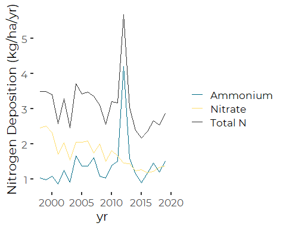

Reviewing Annual Aggregation of Atmospheric Deposition Data
================
Curtis C. Bohlen, Casco Bay Estuary Partnership.
04/06/2021

-   [Introduction](#introduction)
-   [Install Libraries](#install-libraries)
-   [Read Annual Data](#read-annual-data)
    -   [Add Data Quality Flag](#add-data-quality-flag)
    -   [Trend Graphic](#trend-graphic)
        -   [Consistent Units](#consistent-units)
    -   [All Years](#all-years)
    -   [Years that Meet QA Standards](#years-that-meet-qa-standards)
    -   [Remove 2012 Too](#remove-2012-too)
-   [Atmospheric Nitrogen Loading](#atmospheric-nitrogen-loading)
    -   [Mean Loading Rates 2015 -
        2019](#mean-loading-rates-2015---2019)
    -   [Modify Graphic](#modify-graphic)
-   [Annual Nutrient Load Estimates](#annual-nutrient-load-estimates)
    -   [Areas](#areas)
    -   [Deposition to Surface of Bay](#deposition-to-surface-of-bay)
        -   [In Kilograms per Year](#in-kilograms-per-year)
        -   [In Pounds per Year](#in-pounds-per-year)
        -   [In Pounds per Day](#in-pounds-per-day)
    -   [Deposition to Surface of
        Watershed](#deposition-to-surface-of-watershed)
        -   [In kg per year](#in-kg-per-year)
        -   [In Pounds per Year](#in-pounds-per-year-1)
        -   [In Pounds per Day](#in-pounds-per-day-1)


# Introduction

Data on atmospheric deposition is available at several different
temporal scales, including daily, weekly, monthly, seasonal, and annual
summaries. Data is also available in both concentration and
deposition-focused versions.

In this notebook, we focus on developing graphics and a table for value
in the *State of Casco Bay* report. All graphics are based on the annual
summary data

# Install Libraries

``` r
library(readr)
library(tidyverse)
#> Warning: package 'tidyverse' was built under R version 4.0.5
#> -- Attaching packages --------------------------------------- tidyverse 1.3.1 --
#> v ggplot2 3.3.3     v dplyr   1.0.5
#> v tibble  3.1.1     v stringr 1.4.0
#> v tidyr   1.1.3     v forcats 0.5.1
#> v purrr   0.3.4
#> Warning: package 'tibble' was built under R version 4.0.5
#> Warning: package 'tidyr' was built under R version 4.0.5
#> Warning: package 'dplyr' was built under R version 4.0.5
#> Warning: package 'forcats' was built under R version 4.0.5
#> -- Conflicts ------------------------------------------ tidyverse_conflicts() --
#> x dplyr::filter() masks stats::filter()
#> x dplyr::lag()    masks stats::lag()

library(mblm)

library(CBEPgraphics)
load_cbep_fonts()
theme_set(theme_cbep())
```

# Read Annual Data

``` r
sibfldnm <- 'Original_Data'
parent <- dirname(getwd())
sibling <- paste(parent,sibfldnm, sep = '/')

dir.create(file.path(getwd(), 'figures'), showWarnings = FALSE)
```

The data we are pulling provides information on annual LOADINGS per unit
area.

``` r
fn <- 'NTN-ME96-cydep.csv'
annual_data <- read_csv(file.path(sibling, fn)) %>%
  mutate_at (c('Ca','Mg','K', 'Na','totalN', 'Cl', 'SO4', 'Br'), ~na_if(., -9)) %>%
  select(-c('Ca','Mg','K', 'Na', 'Cl','SO4', 'Br')) %>%
  select(-seas, -siteID)
#> 
#> -- Column specification --------------------------------------------------------
#> cols(
#>   .default = col_double(),
#>   siteID = col_character(),
#>   seas = col_character(),
#>   startDate = col_datetime(format = ""),
#>   lastDate = col_datetime(format = "")
#> )
#> i Use `spec()` for the full column specifications.

long_data <- annual_data %>%
  pivot_longer(NH4:totalN, names_to = 'Parameter', values_to = 'Value')
```

## Add Data Quality Flag

THe data validation metadata for these data includes the following
statement:

> Three Completeness Criteria form the basis for the decision to include
> the laboratory chemistry data from a site in the Annual Isopleth Maps.
> All three criteria must be met.

The specific criteria are as follows:

| Name      | Value | Meaning                                                                                                                             |
|-----------|-------|-------------------------------------------------------------------------------------------------------------------------------------|
| Criteria1 | 75    | Percentage of the summary period for which there are valid samples.                                                                 |
| Criteria2 | 90    | Percentage of the summary period for which precipitation amounts are available either from the rain gage or from the sample volume. |
| Criteria3 | 75    | Percentage of the total measured precipitation associated with valid samples.                                                       |

We add a flag to mark if all data quality metrics were met for annual
totals or not:

``` r
annual_data <- annual_data %>%
  mutate(fully_valid = Criteria1 >= 75 & Criteria2 >= 90 & Criteria3 >= 75)
```

## Trend Graphic

### Consistent Units

``` r
MW_NH4 <- 14.007 + (1.008 * 4)
MW_NO3 <- 14.007 +(15.999 * 3)
MW_N <- 14.007
tmp <- annual_data %>%
  mutate(NH4 = NH4 * MW_N/ MW_NH4,
         NO3 = NO3 * MW_N/ MW_NO3) %>%
  pivot_longer(NH4:totalN, names_to = 'Parameter', values_to = 'Value')
```

``` r
ggplot(tmp, aes(yr, Value, color = Parameter)) +
  geom_line() +
  ylab('Nitrogen Deposition (kg/ha/yr)') +
  scale_color_manual(name = '', values = cbep_colors(),
                     labels = c('Ammonium', 'Nitrate', 'Total N'))
```



We a huge spike in ammonium in 2012. There is a possible downward trend
in nitrate. Any downward trend in TN may be masked by that spike in
2012, especially if we use least squares models.

``` r
annual_data %>%
  mutate(NH4 = NH4 * MW_N/ MW_NH4,
         NO3 = NO3 * MW_N/ MW_NO3) %>%
  select (-totalN) %>%
  pivot_longer(c(NH4, NO3),
               names_to = 'Parameter',
               values_to = 'Value') %>%

  ggplot(aes(yr, Value, fill = Parameter)) +
  geom_col() +
  scale_fill_manual(name = '', values = cbep_colors()[5:6],
                     labels = c('Ammonium', 'Nitrate', 'Total N')) +
  theme_cbep(base_size = 12) +
  theme(legend.position = c(0.25, 0.85)) +
  ylab('Concentration (mg/l as N)') +
  xlab('')
```


\# Exploring Correlations of TN and Year One obvious question is whether
there are long-term trends in atmospheric deposition for NH\_4, NO\_3 or
TN.

A downward trend in nitrate appears likely. A trend in TN, based in part
on that downward trend, appears possible.

There are significant data quality questions to contend with here, as

1.  Not all years include sufficient complete data to comply with data
    completeness criteria established for the atmospheric deposition
    data program.  
2.  The anomalous high NH\_4 levels in 2012 appear to reflect a local
    source – specifically the decommissioning of the manure management
    pit at Wolfe’s Neck Farm.

Given the obvious outlier for TN in 2012, we prefer to use a statistic
that is resistant to outliers. Here that can be either a rank
correlation or Kendall’s Tau. We calculate both.

## All Years

``` r
cor.test(annual_data$yr, annual_data$totalN, method = 'spearman')
#> 
#>  Spearman's rank correlation rho
#> 
#> data:  annual_data$yr and annual_data$totalN
#> S = 2764, p-value = 0.007536
#> alternative hypothesis: true rho is not equal to 0
#> sample estimates:
#>        rho 
#> -0.5607002
cor.test(annual_data$yr, annual_data$totalN, method = 'kendall')
#> 
#>  Kendall's rank correlation tau
#> 
#> data:  annual_data$yr and annual_data$totalN
#> T = 66, p-value = 0.00476
#> alternative hypothesis: true tau is not equal to 0
#> sample estimates:
#>        tau 
#> -0.4285714
```

So we appear to have a significant decline in TN (and thus presumably
NO3). The data providers do not use data from ears that do not meet
Criteria 1 through 3. We should check if results are robust if we
restrict to years that meet their data QA criteria.

## Years that Meet QA Standards

If we remove several years with data that does not meet completeness
criteria, we find a

``` r
tmp1 <- annual_data %>%filter(fully_valid)
cor.test(tmp1$yr, tmp1$totalN, method = 'spearman')
#> 
#>  Spearman's rank correlation rho
#> 
#> data:  tmp1$yr and tmp1$totalN
#> S = 1120, p-value = 0.1415
#> alternative hypothesis: true rho is not equal to 0
#> sample estimates:
#>       rho 
#> -0.372549
cor.test(tmp1$yr, tmp1$totalN, method = 'kendall')
#> 
#>  Kendall's rank correlation tau
#> 
#> data:  tmp1$yr and tmp1$totalN
#> T = 50, p-value = 0.1513
#> alternative hypothesis: true tau is not equal to 0
#> sample estimates:
#>        tau 
#> -0.2647059
```

So the significant results do not hold up if we remove those years.

## Remove 2012 Too

We may also want to remove the outlier year of 2012, assuming the
anomalous NH4 values are due to work on the manure management system at
Wolfe’s Neck Farm.

``` r
tmp1 <- annual_data %>% filter(fully_valid) %>% filter(yr != 2012)
cor.test(tmp1$yr, tmp1$totalN, method = 'spearman')
#> 
#>  Spearman's rank correlation rho
#> 
#> data:  tmp1$yr and tmp1$totalN
#> S = 994, p-value = 0.07377
#> alternative hypothesis: true rho is not equal to 0
#> sample estimates:
#>        rho 
#> -0.4617647
cor.test(tmp1$yr, tmp1$totalN, method = 'kendall')
#> 
#>  Kendall's rank correlation tau
#> 
#> data:  tmp1$yr and tmp1$totalN
#> T = 39, p-value = 0.06411
#> alternative hypothesis: true tau is not equal to 0
#> sample estimates:
#>   tau 
#> -0.35
```

And that returns us to marginally significant correlations by all three
tests.

``` r
tn_mblm <- mblm(totalN ~ yr, data = annual_data)
summary(tn_mblm)
#> Warning in wilcox.test.default(z$intercepts): cannot compute exact p-value with
#> ties
#> Warning in wilcox.test.default(z$slopes): cannot compute exact p-value with ties
#> Warning in wilcox.test.default(z$intercepts): cannot compute exact p-value with
#> ties
#> Warning in wilcox.test.default(z$slopes): cannot compute exact p-value with ties
#> 
#> Call:
#> mblm(formula = totalN ~ yr, dataframe = annual_data)
#> 
#> Residuals:
#>     Min      1Q  Median      3Q     Max 
#> -0.9442 -0.4305 -0.1148  0.1004  2.6563 
#> 
#> Coefficients:
#>             Estimate      MAD V value Pr(>|V|)   
#> (Intercept) 89.42994 29.18895     228  0.00104 **
#> yr          -0.04294  0.01427      25  0.00104 **
#> ---
#> Signif. codes:  0 '***' 0.001 '**' 0.01 '*' 0.05 '.' 0.1 ' ' 1
#> 
#> Residual standard error: 0.7272 on 20 degrees of freedom
```

That projects a decline of 0.04 mg/l TN as N per year.

``` r
newdat <- tibble(yr = 1998:2019)
preds = predict(tn_mblm, newdata = newdat)
newdat$pred = preds
```

``` r
plt <- ggplot(annual_data, aes(yr, totalN)) +
  geom_point(aes(color = fully_valid),
             size = 2) +
  scale_color_manual(values = cbep_colors()[3:4],
                     name = '', labels = c('Incomplete Data', 'Complete Data')) +
  geom_line(data = newdat, mapping = aes(x = yr, y = pred)) +
  xlab('') +
  ylab('Nitrogen Deposition (kg/ha)') +
  theme_cbep(base_size = 12) +
  theme(legend.position = c(.25, .8)) +
  xlim(1998, 2020)
plt
```


# Atmospheric Nitrogen Loading

## Mean Loading Rates 2015 - 2019

These are in the original units, kg/ha. NOT kg/ha of N.

``` r
recent_loads <- annual_data %>%
  filter(yr > 2014) %>%
  select(NH4:totalN) %>%
  summarize(across( .fn = mean))
recent_loads
#> # A tibble: 1 x 3
#>     NH4   NO3 totalN
#>   <dbl> <dbl>  <dbl>
#> 1  1.61  5.64   2.52
tn_rate <- recent_loads$totalN
```

## Modify Graphic

``` r
dat <- tibble(yr = 2015:2019, val = tn_rate)
plt2 <- plt + 
  geom_line(data = dat, mapping = aes(yr, val), color = cbep_colors()[5]) +
  annotate('text', x = 2014, y = 2.6, label = 'Avg Rate 2015-2019\n 2.52 kg/ha',
           size = 3, color = cbep_colors()[5], hjust = 1)
plt2
```


``` r
ggsave('figures/tn_trend.pdf', device = cairo_pdf, width = 5, height = 4)
```

``` r
plt2 +
  annotate('text', x = 2012, y = 5.69, label = 'O',
           size = 6, color = cbep_colors()[1], hjust = .5) +
    annotate('text', x = 2012, y = 5.4, label = 'Influenced by\nlocal source',
           size = 3, color = cbep_colors()[1], hjust = .5) +
  
ggsave('figures/tn_trend_with.pdf', device = cairo_pdf, width = 5, height = 4)
```


# Annual Nutrient Load Estimates

## Areas

Based on CBEP GIS data.

|                                        |           |
|----------------------------------------|-----------|
| Watershed Area, including islands      | 2554 km^2 |
| Area of the Bay (inside Half Way Rock) | 535 km^2  |

## Deposition to Surface of Bay

### In Kilograms per Year

``` r
535 * 100 * tn_rate
#> [1] 134948.4
```

### In Pounds per Year

``` r
535 * 100 * tn_rate * 2.20462
#> [1] 297509.9
```

### In Pounds per Day

``` r
535 * 100 * tn_rate * 2.20462 / 365
#> [1] 815.0957
```

## Deposition to Surface of Watershed

### In kg per year

``` r
2554 * 100 * tn_rate
#> [1] 644221
```

### In Pounds per Year

``` r
2554 * 100 * tn_rate * 2.20462
#> [1] 1420262
```

### In Pounds per Day

``` r
2554 * 100 * tn_rate * 2.20462 / 365
#> [1] 3891.13
```
